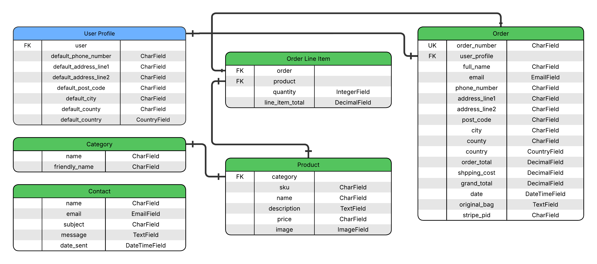

# Pixel Shop

## Table of Contents

- [Overview](#overview)
- User Experience (UX)
  - [Strategy (Site Goals)](#strategy-site-goals)
  - [Scope (User Stories)](#scope-user-stories)
  - [Entity Relationship Diagram (ERD)](#entity-relationship-diagram-erd)
  - [Structure (Design Choices)](#structure-design-choices)
  - [Skeleton (Wireframes)](#skeleton-wireframes)
  - [Surface (Visual Design)](#surface-visual-design)
- [Technologies Used](#technologies-used)
- [Languages](#languages)
- [Libraries & Frameworks](#libraries--frameworks)
- [Tools](#tools)
- [Deployment](#deployment)
- [Existing Features](#existing-features)
- [Future Features](#future-features)
- [Testing](#testing)
- [Bugs](#bugs)
- [Credits](#credits)

---

## Overview

PixelShop is a fictitious gaming store created for my Code Institute Milestone 4 project. Built to demonstrate the key skills I have learnt including user login and registration, adding, editing and deleting products from the frontend, Stripe payments, and storing images with AWS.

The store isn't real, it is purely educational to show what I have managed to build while learning new technologies.

[Back to the top](#table-of-contents)

## Strategy (Site Goals)

**Primary Goal:** Build an e-commerce Django application that demonstrates full-stack development skills, focusing on user authentication, payment processing, and cloud-based media storage.

**Target Audience:** Gaming enthusiasts seeking merchandise and accessories.

**Objectives & Goals:**

- Provide a functional online store where users can browse and purchase gaming merchandise.
- Enable secure customer registration and login.
- Provide CRUD functionality for admin users to manage products through the frontend.
- Integrate Stripe for safe payment.
- Store product images securely using AWS S3.
- Responsive design across desktop, tablet, and mobile devices.

[Back to the top](#table-of-contents)

## Scope (User Stories)

The MoSCoW prioritisation method was used to organise the user stories.

You can view the GitHub Project [here](https://github.com/users/faelf/projects/5).

| Feature                | User Story                                                                                                                              |
| ---------------------- | --------------------------------------------------------------------------------------------------------------------------------------- |
| Navigation Bar         | As a non-registered user, I want to use the navigation bar so that I can easily access different sections of the page.                  |
| Store Information      | As a non-registered user, I want to find information about the store so that I can quickly find the store location and contact details. |
| Browse Products        | As a non-registered user, I want to browse products so that I can see what items are available in the store.                            |
| View Product Details   | As a non-registered user, I want to view product details so that I can decide if I want to purchase a product.                          |
| Search Products        | As a non-registered user, I want to search products so that I can find items are available in the store.                                |
| View Cart Summary      | As a non-registered user, I want to view cart summary so that I can edit and review my selected items.                                  |
| Checkout & Pay         | As a non-registered user, I want to checkout and pay so that I can complete purchases.                                                  |
| Register Account       | As a non-registered user, I want to to register so that my information can be saved.                                                    |
| Login/Logout           | As a registered user, I want to login/logout so that I can securely access my account.                                                  |
| Update Account Details | As a registered user, I want to edit account details so that my personal information stays up to date.                                  |
| View Order History     | As a registered user, I want to view order history so that I can track my past purchases.                                               |
| Admin Login            | As an admin, I want to login to admin panel so that I can access admin functionality.                                                   |
| Create Products        | As an admin, I want to Create products (CRUD) so that new products are available for customers to buy.                                  |
| Edit Products          | As an admin, I want to Edit products (CRUD) so that I can update product details as needed.                                             |
| Delete Products        | As an admin, I want to Delete products (CRUD) so that I can remove unavailable products from the store.                                 |
| View Orders            | As an admin, I want to View orders so that I can manage and process customer purchases.                                                 |
| Manage Users           | As an admin, I want to Manage users so that I can deactivate or reactivate user accounts if needed.                                     |

[Back to the top](#table-of-contents)

## Entity Relationship Diagram (ERD)

- `User Profile` extends the built-in Django User model to store default delivery information.
- `Category` and `Product` have a one-to-many relationship.
- `Order` and `Order Line Item` represent the checkout system, with each order linked to multiple products.
- `Contact` stores messages submitted through the contact form.

[Back to the top](#table-of-contents)

## Structure (Design Choices)

### Colour Palette

### Typography

[Back to the top](#table-of-contents)

## Skeleton (Wireframes)

[Back to the top](#table-of-contents)

## Surface (Visual Design)

[Back to the top](#table-of-contents)

## Technologies Used

### Languages

### Libraries & Frameworks

### Tools

[Back to the top](#table-of-contents)

## Deployment

[Back to the top](#table-of-contents)

## Existing Features

[Back to the top](#table-of-contents)

## Future Features

[Back to the top](#table-of-contents)

## Testing

[Back to the top](#table-of-contents)

## Bugs

[Back to the top](#table-of-contents)

## Credits

[Back to the top](#table-of-contents)
