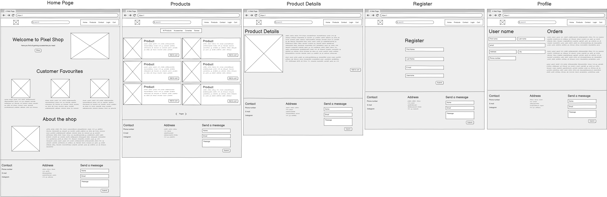
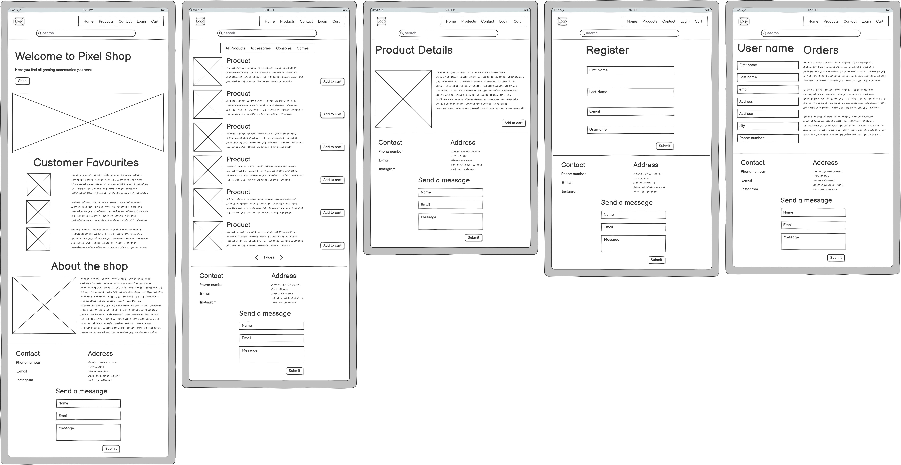
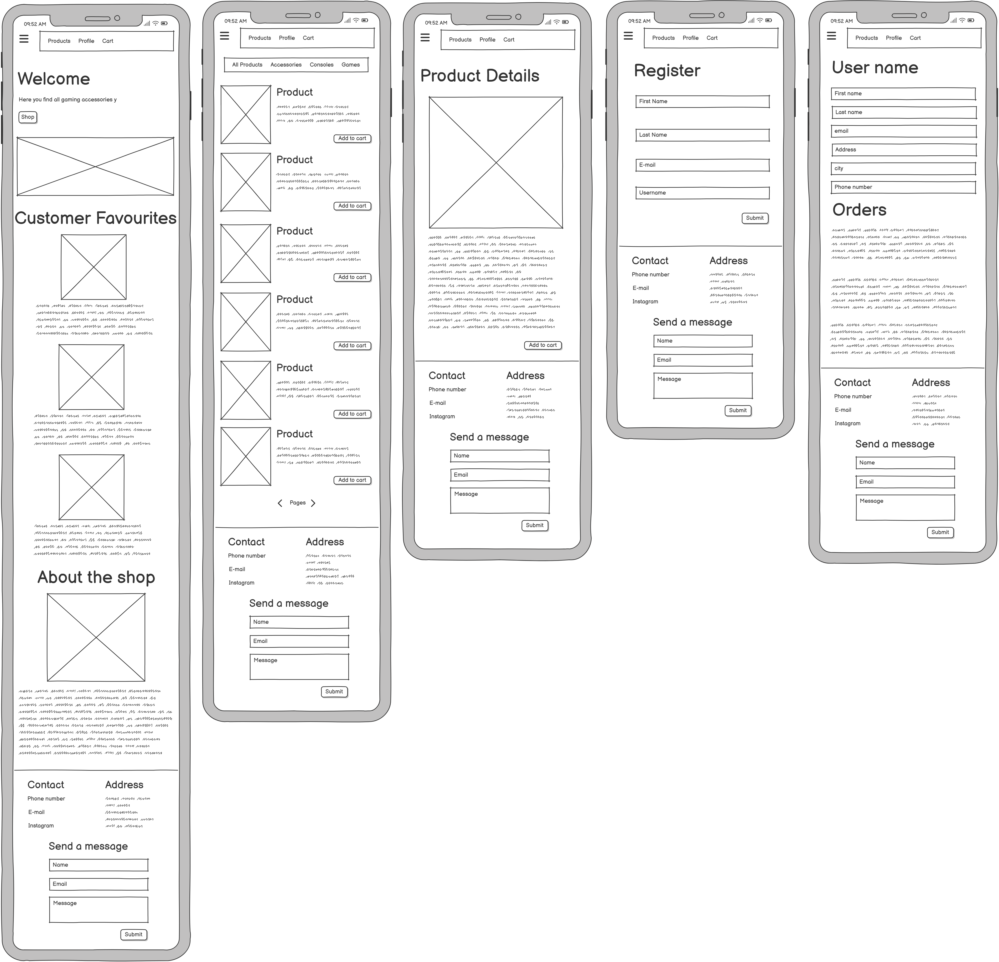
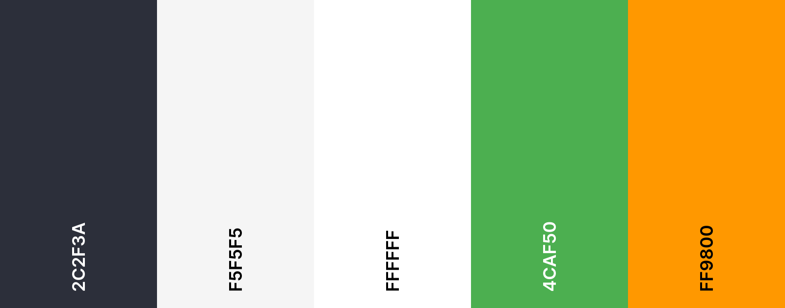

# Pixel Shop

## Table of Contents

- [Overview](#overview)
- User Experience (UX)
  - [Strategy (Site Goals)](#strategy-site-goals)
  - [Scope (User Stories)](#scope-user-stories)
  - [Entity Relationship Diagram (ERD)](#entity-relationship-diagram-erd)
  - [Structure (Design Choices)](#structure-design-choices)
  - [Skeleton (Wireframes)](#skeleton-wireframes)
  - [Surface (Visual Design)](#surface-visual-design)
- [Technologies Used](#technologies-used)
- [Languages](#languages)
- [Libraries & Frameworks](#libraries--frameworks)
- [Tools](#tools)
- [Deployment](#deployment)
- [Existing Features](#existing-features)
- [Future Features](#future-features)
- [Testing](#testing)
- [Bugs](#bugs)
- [Credits](#credits)

---

## Overview

PixelShop is a fictitious gaming store created for my Code Institute Milestone 4 project. Built to demonstrate the key skills I have learnt including user login and registration, adding, editing and deleting products from the frontend, Stripe payments, and storing images with AWS.

The store isn't real, it is purely educational to show what I have managed to build while learning new technologies.

[Back to the top](#table-of-contents)

## Strategy (Site Goals)

**Primary Goal:** Build an e-commerce Django application that demonstrates full-stack development skills, focusing on user authentication, payment processing, and cloud-based media storage.

**Target Audience:** Gaming enthusiasts seeking merchandise and accessories.

**Objectives & Goals:**

- Provide a functional online store where users can browse and purchase gaming merchandise.
- Enable secure customer registration and login.
- Provide CRUD functionality for admin users to manage products through the frontend.
- Integrate Stripe for safe payment.
- Store product images securely using AWS S3.
- Responsive design across desktop, tablet, and mobile devices.

[Back to the top](#table-of-contents)

## Scope (User Stories)

The MoSCoW prioritisation method was used to organise the user stories.

You can view the GitHub Project [here](https://github.com/users/faelf/projects/5).

| Feature                | User Story                                                                                                                              |
| ---------------------- | --------------------------------------------------------------------------------------------------------------------------------------- |
| Navigation Bar         | As a non-registered user, I want to use the navigation bar so that I can easily access different sections of the page.                  |
| Store Information      | As a non-registered user, I want to find information about the store so that I can quickly find the store location and contact details. |
| Browse Products        | As a non-registered user, I want to browse products so that I can see what items are available in the store.                            |
| View Product Details   | As a non-registered user, I want to view product details so that I can decide if I want to purchase a product.                          |
| Search Products        | As a non-registered user, I want to search products so that I can find items are available in the store.                                |
| View Cart Summary      | As a non-registered user, I want to view cart summary so that I can edit and review my selected items.                                  |
| Checkout & Pay         | As a non-registered user, I want to checkout and pay so that I can complete purchases.                                                  |
| Register Account       | As a non-registered user, I want to to register so that my information can be saved.                                                    |
| Login/Logout           | As a registered user, I want to login/logout so that I can securely access my account.                                                  |
| Update Account Details | As a registered user, I want to edit account details so that my personal information stays up to date.                                  |
| View Order History     | As a registered user, I want to view order history so that I can track my past purchases.                                               |
| Admin Login            | As an admin, I want to login to admin panel so that I can access admin functionality.                                                   |
| Create Products        | As an admin, I want to Create products (CRUD) so that new products are available for customers to buy.                                  |
| Edit Products          | As an admin, I want to Edit products (CRUD) so that I can update product details as needed.                                             |
| Delete Products        | As an admin, I want to Delete products (CRUD) so that I can remove unavailable products from the store.                                 |
| View Orders            | As an admin, I want to View orders so that I can manage and process customer purchases.                                                 |
| Manage Users           | As an admin, I want to Manage users so that I can deactivate or reactivate user accounts if needed.                                     |

[Back to the top](#table-of-contents)

## Entity Relationship Diagram (ERD)

- `User Profile` extends the built-in Django User model to store default delivery information.
- `Category` and `Product` have a one-to-many relationship.
- `Order` and `Order Line Item` represent the checkout system, with each order linked to multiple products.
- `Contact` stores messages submitted through the contact form.


[Back to the top](#table-of-contents)

## Structure (Design Choices)

- **Navigation bar:** Responsive across different screen sizes, with links to Home, Products, Cart, and Account pages.
- **Home page:** Highlights featured products and includes a short introduction about the shop.
- **Products:** Can be searched, and filtered by category.
- **Product detail pages:** Show full product information and allow adding items to the cart.
- **Cart & Checkout:** Available to all users, so anyone can shop at the shop.
- **User Account Pages:** For registered users to store default delivery information.
- **Admin User:** CRUD functionality to manage products.
- **Contact Form:** For users to submit inquiries.
- **Footer:** Visible on all pages with information about contact details and store location.

[Back to the top](#table-of-contents)

## Skeleton (Wireframes)

The wireframes provide a rough visual outline of how I imagine the webpage to look. They are not final designs, but rather a guide to illustrate the planned layout, structure, and key features of each page. The goal is to give a clear idea of content placement and user flow before moving into the detailed design and development stages.

### Desktop



### Tablet



### Mobile



[Back to the top](#table-of-contents)

## Surface (Visual Design)

- **Colour palette:** A modern, gaming-inspired palette with a dark navbar,
  light background for readability.



- **Typography:** Google Fonts are used to create hierarchy and readability:

  - **Audiowide** for main headings.
  - **Bebas Neue** for subheadings and section titles.
  - **Roboto** for body text and product descriptions.

- **Icons:** Font Awesome icons provide clear visual cues for navigation, cart,
  and user actions.

- **Imagery:** High-quality product images.

- **Layout:** Grid-based product cards allow easy browsing, with consistent
  spacing and alignment.

- **Responsiveness:** All pages adapt seamlessly to different screen sizes,
  ensuring a consistent experience on desktop, tablet, and mobile.

[Back to the top](#table-of-contents)

## Technologies Used

### Languages

- HTML
- CSS
- Python
- JavaScript

### Libraries & Frameworks

- [Django](https://www.djangoproject.com/) – Python web framework
- [dj-database-url](https://pypi.org/project/dj-database-url/) – Parses database URLs into Django `DATABASES` settings
- [psycopg2](https://pypi.org/project/psycopg2/) – PostgreSQL database adapter
- [gunicorn](https://pypi.org/project/gunicorn/) – WSGI HTTP server for running Django in production
- [whitenoise](http://whitenoise.evans.io/en/stable/) – Serves static files in production
- [Bootstrap](https://getbootstrap.com/) – Frontend CSS framework for responsive design

### Tools

- **[GitHub](https://github.com/)** – For project hosting.
- **[Git](https://git-scm.com/)** – For version control.
- **[Coolors](https://coolors.co/)** – For generating the colour palette.
- **[Google Fonts](https://fonts.google.com/)** – For typography.
- **[Lucidchart](https://www.lucidchart.com/)** – For designing the ERD.
- **[Balsamiq](https://balsamiq.com/)** – For creating wireframes.
- **[Font Awesome](https://fontawesome.com/)** – Icons used for UI elements.

[Back to the top](#table-of-contents)

## Deployment

### Create & Clone a Repo via GitHub Desktop

1. Open **GitHub Desktop** and log in.
2. Click **File → New Repository**.
3. Enter a **name**, **description** (optional), and choose **local path**.
4. Click **Create Repository** → the repo is created locally.
5. Go to **Repository → Publish Repository** to upload it to GitHub.

### In VS Code

1. Open the cloned repository in VS Code.
2. Create a virtual environment.
3. Install Django:
   ```bash
   pip install django
   ```
4. Create the Django project, ensuring you include the trailing dot to create it in the current directory:
   ```bash
   django-admin startproject (Project name) .
   ```
5. Create a Django app:
   ```bash
   python manage.py startapp (App name)
   ```
6. Add the app to `settings.py`

   ```Python
   INSTALLED_APPS = [
       "django.contrib.admin",
       ...
       "django.contrib.staticfiles",

       # Page Apps
       "home",
   ]
   ```

7. In the apps template folder, create a folder with the app name, and create a html file to be rendered.
8. Create a simple view to render a template in the app's `views.py`

   ```Python
   from django.views.generic import TemplateView

   class HomeView(TemplateView):
       template_name = "home/home.html"
   ```

9. Create a `urls.py` file within the app folder, and connect to `views.py`.

   ```Python
   from django.urls import path
   from .views import HomeView

   urlpatterns = [
       path("", HomeView.as_view(), name="home"),
   ]
   ```

10. In the project's `urls.py`, we need to include the app's `urls.py`.

    ```Python
    from django.contrib import admin
    from django.urls import path, include

    urlpatterns = [
    	path('admin/', admin.site.urls),
    	path('', include('home.urls')),
    ]
    ```

11. Create a database.
12. Install `psycopg2`, the PostgreSQL adapter:
    ```bash
    pip install psycopg2
    ```
13. Install `dj-database-url` for parsing database URLs:
    ```bash
    pip install dj-database_url
    ```
14. In `settings.py` add the `dj-database_url to the top`
    ```Python
    import dj_database_url
    ```
15. Create a `env.py` in the root dir. And add it to `.gitignore`.
16. In the `env.py` create the keys that are not meant to be committed.

    ```Python
    import os

    # Django Settings

    # Secret key
    os.environ["SECRET_KEY"] = (
        "Get the secret key from settings.py"
    )

    # Debug mode
    os.environ["DJANGO_DEBUG"] = "True"


    # Allowed hosts
    os.environ["DJANGO_ALLOWED_HOSTS"] = "127.0.0.1,localhost,.herokuapp.com"

    # Database

    # SQLite (Django default)
    # os.environ["DATABASE_URL"] = "sqlite:///db.sqlite3"

    # Postgres (Created)
    os.environ["DATABASE_URL"] = (
    	"This will be the database URL"
    )
    ```

17. In `settings.py` add this to the top.
    ```Python
    import os
    if os.path.isfile("env.py"):
    	import env  # noqa
    ```
18. Still in `settings.py`, set the variables values for the `env.py`.
    ```Python
    SECRET_KEY = os.environ.get("SECRET_KEY")
    DEBUG = os.environ.get("DJANGO_DEBUG", "False") == "True"
    ALLOWED_HOSTS = os.environ.get("DJANGO_ALLOWED_HOSTS", "").split(",")
    ```
19. Connect the Postgres database in `settings.py`

    ```Python
    # Use dj-database-url to parse the database URL from environment variable
    DATABASE_URL = os.environ.get("DATABASE_URL")

    if DATABASE_URL and DATABASE_URL.startswith("postgres"):
        # Use Postgres
        import dj_database_url
        DATABASES = {
            "default": dj_database_url.parse(DATABASE_URL)
    	}
    else:
        # Use SQLite (Django Default)
        DATABASES = {
            "default": {
                "ENGINE": "django.db.backends.sqlite3",
                "NAME": BASE_DIR / "db.sqlite3",
            }
        }
    ```

20. Run your first database migration:
    ```bash
    python manage.py migrate
    ```
21. Create a superuser:
    ```bash
    python manage.py createsuperuser
    ```
22. Install Gunicorn to handle web requests.
    ```bash
    pip install gunicorn
    ```
23. Create a `Procfile` in the root of your project with the following command:
    ```bash
    web: gunicorn (Project name).wsgi
    ```
24. In your `settings.py` ensure `WSGI_APPLICATION` is set correctly:
    ```python
    WSGI_APPLICATION = '(Project name).wsgi.application'
    ```
25. Specify the Python version for your development environment using a `.python-version` file.
26. Install `whitenoise` for serving static files in production:
    ```bash
    pip install whitenoise
    ```
27. Edit your `settings.py` file and add `WhiteNoise` to the `MIDDLEWARE` list, placing it just below `SecurityMiddleware`:
    ```python
    MIDDLEWARE = [
    # ...
    "django.middleware.security.SecurityMiddleware",
    "whitenoise.middleware.WhiteNoiseMiddleware",
    # ...
    ]
    ```
28. Add the following to the bottom of your `settings.py` file to configure static file collection:

    ```python
    # Static files (CSS, JavaScript, Images)
    # https://docs.djangoproject.com/en/5.2/howto/static-files/
    STATIC_URL = "static/"

    # Additional locations to look for static files (optional)
    STATICFILES_DIRS = [BASE_DIR / "static"]

    # This is where Django will collect all static files for production
    STATIC_ROOT = BASE_DIR / "staticfiles"
    ```

29. Run `collectstatic` to gather all static files into the `staticfiles` directory:
    ```bash
    python manage.py collectstatic
    ```
30. Add the `staticfiles` folder to the `.gitignore`.
31. Create a `requirements.txt` file with all installed dependencies:
    ```bash
    pip freeze > requirements.txt
    ```
32. Commit all changes and push your code to your GitHub repository.

### Heroku Deployment

1. Log in to the Heroku dashboard.
2. Click **New** and select **Create new app**.
3. Enter a unique app name.
4. Choose the deployment region.
5. In the **Settings** tab, navigate to **Config Vars** and add all necessary environment variables, including:
   - `DATABASE_URL`
   - `SECRET_KEY`
6. Under the **Deployment method** section, connect the app to your GitHub repository.
7. Press **Deploy Branch**.
8. After deployment is complete, test the deployed page.

[Back to the top](#table-of-contents)

## Existing Features

[Back to the top](#table-of-contents)

## Future Features

[Back to the top](#table-of-contents)

## Testing

[Back to the top](#table-of-contents)

## Bugs

[Back to the top](#table-of-contents)

## Credits

### Images

- [Hero Image](https://www.pexels.com/photo/a-close-up-shot-of-a-nintendo-switch-6993182/)
- Store picture on about section was generated by Gemini.

[Back to the top](#table-of-contents)
