# 🌍 Overview

PixelShop is a fictitious gaming store created for my Code Institute Milestone 4 project. Built to demonstrate the key skills I have learnt including user login and registration, adding, editing and deleting products from the frontend, Stripe payments, and storing images with AWS.

The store isn't real, it is purely educational to show what I have managed to build while learning new technologies.

You can vist the live page [here](https://pixelshop.faelf.uk/)

# 🧭 User Experience (UX)

## 🎯 Strategy (Site Goals)

**Primary Goal:** Build an e-commerce Django application that demonstrates full-stack development skills, focusing on user authentication, payment processing, and cloud-based media storage.

**Target Audience:** Gaming enthusiasts seeking merchandise and accessories.

**Objectives & Goals:**

- Provide a functional online store where users can browse and purchase gaming merchandise.
- Enable secure customer registration and login.
- Provide CRUD functionality for admin users to manage products through the frontend.
- Integrate Stripe for safe payment.
- Store product images securely using AWS S3.
- Responsive design across desktop, tablet, and mobile devices.

## 🧾 Scope (User Stories)

The MoSCoW prioritisation method was used to organise the user stories. You can view the GitHub Project [here](https://github.com/users/faelf/projects/5).

| Feature                | User Story                                                                                                                              |
| ---------------------- | --------------------------------------------------------------------------------------------------------------------------------------- |
| Navigation Bar         | As a non-registered user, I want to use the navigation bar so that I can easily access different sections of the page.                  |
| Store Information      | As a non-registered user, I want to find information about the store so that I can quickly find the store location and contact details. |
| Browse Products        | As a non-registered user, I want to browse products so that I can see what items are available in the store.                            |
| View Product Details   | As a non-registered user, I want to view product details so that I can decide if I want to purchase a product.                          |
| Search Products        | As a non-registered user, I want to search products so that I can find items are available in the store.                                |
| View Cart Summary      | As a non-registered user, I want to view cart summary so that I can edit and review my selected items.                                  |
| Checkout & Pay         | As a non-registered user, I want to checkout and pay so that I can complete purchases.                                                  |
| Register Account       | As a non-registered user, I want to to register so that my information can be saved.                                                    |
| Login/Logout           | As a registered user, I want to login/logout so that I can securely access my account.                                                  |
| Update Account Details | As a registered user, I want to edit account details so that my personal information stays up to date.                                  |
| View Order History     | As a registered user, I want to view order history so that I can track my past purchases.                                               |
| Admin Login            | As an admin, I want to login to admin panel so that I can access admin functionality.                                                   |
| Create Products        | As an admin, I want to Create products (CRUD) so that new products are available for customers to buy.                                  |
| Edit Products          | As an admin, I want to Edit products (CRUD) so that I can update product details as needed.                                             |
| Delete Products        | As an admin, I want to Delete products (CRUD) so that I can remove unavailable products from the store.                                 |
| View Orders            | As an admin, I want to View orders so that I can manage and process customer purchases.                                                 |
| Manage Users           | As an admin, I want to Manage users so that I can deactivate or reactivate user accounts if needed.                                     |

## 🧠 Entity Relationship Diagram (ERD)

- `User Profile` extends the built-in Django User model to store default delivery information.
- `Category` and `Product` have a one-to-many relationship.
- `Order` and `Order Line Item` represent the checkout system, with each order linked to multiple products.
- `Contact` stores messages submitted through the contact form.

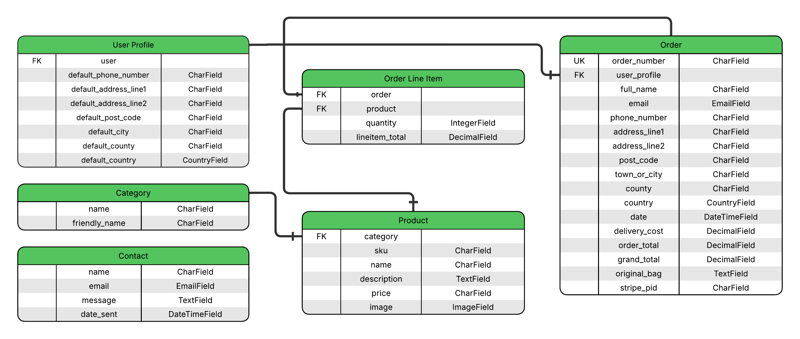

## 🏗️ Structure (Design Choices)

- **Navigation bar:** Responsive across different screen sizes, with links to Home, Products, Cart, and Account pages.
- **Home page:** Highlights featured products and includes a short introduction about the shop.
- **Products:** Can be searched, and filtered by category.
- **Product detail pages:** Show full product information and allow adding items to the cart.
- **Cart & Checkout:** Available to all users, so anyone can shop at the shop.
- **User Account Pages:** For registered users to store default delivery information.
- **Admin User:** CRUD functionality to manage products.
- **Contact Form:** For users to submit inquiries.
- **Footer:** Visible on all pages with information about contact details and store location.

## 🩻 Skeleton (Wireframes)

The wireframes provide a rough visual outline of how I imagine the webpage to look. They are not final designs, but rather a guide to illustrate the planned layout, structure, and key features of each page. The goal is to give a clear idea of content placement and user flow before moving into the detailed design and development stages.

### Desktop

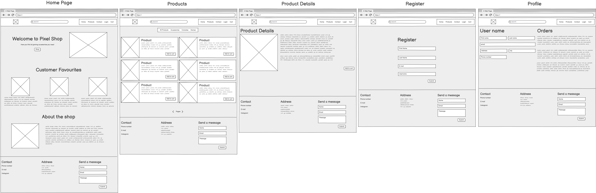

### Tablet

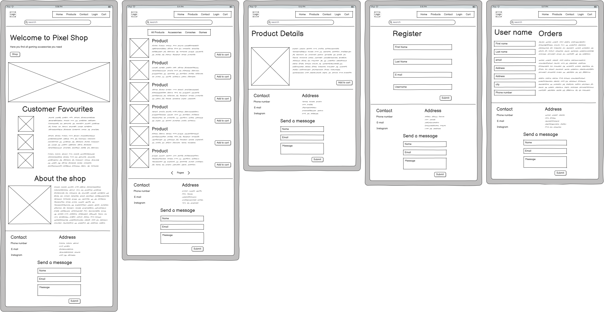

### Mobile

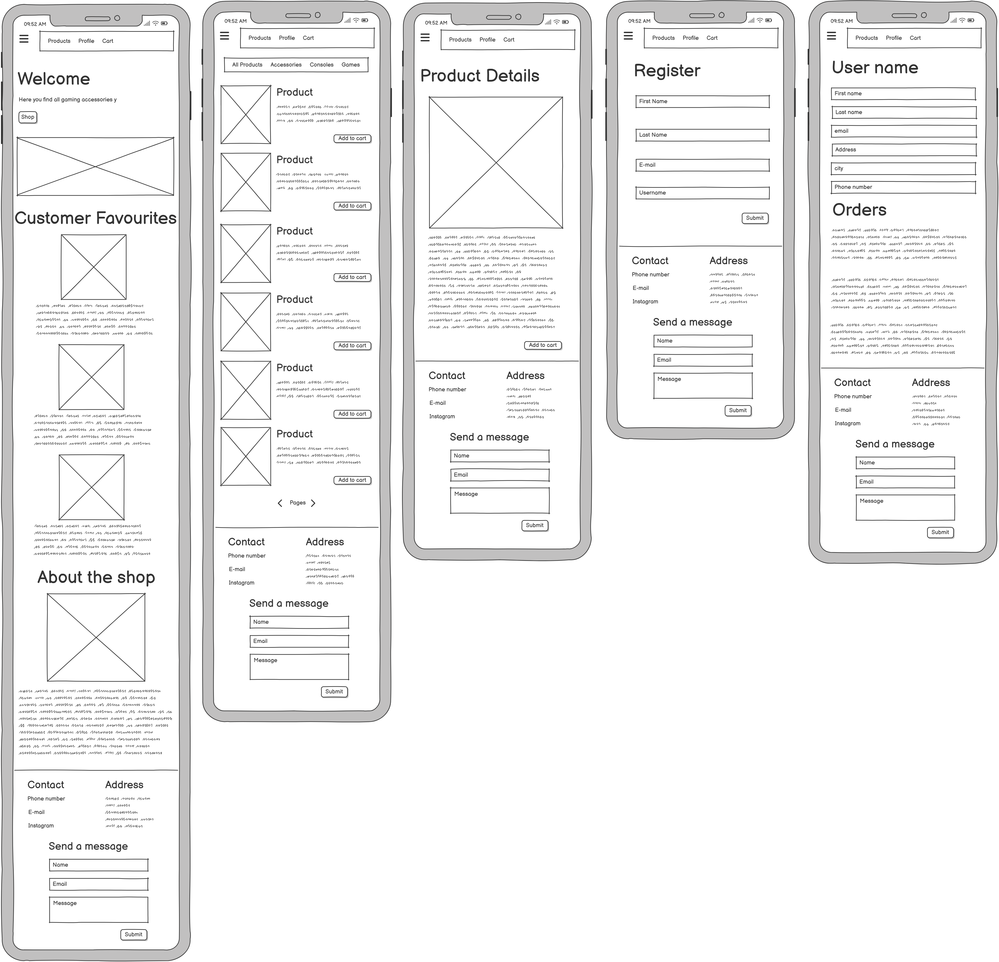

## 🎨 Surface (Visual Design)

- **Colour palette:** A modern, gaming-inspired palette with a dark navbar,
  light background for readability.

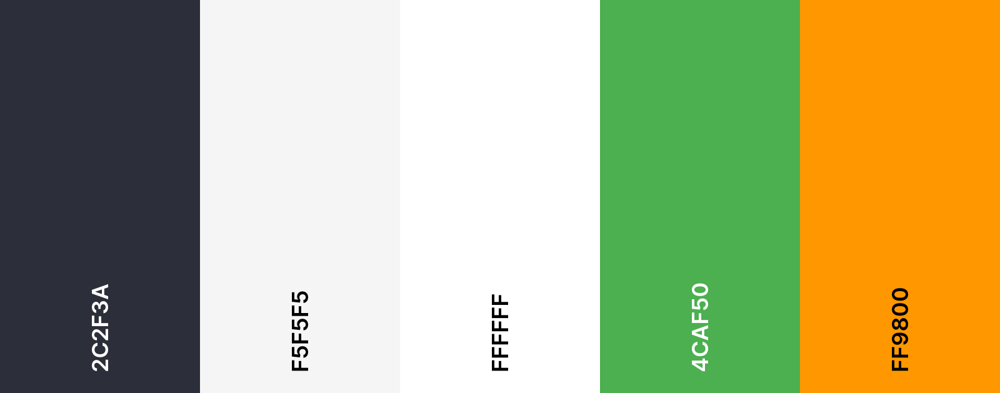

- **Typography:** Google Fonts are used to create hierarchy and readability:
  - **Audiowide** for main headings.
  - **Bebas Neue** for subheadings and section titles.
  - **Roboto** for body text and product descriptions.

- **Icons:** Font Awesome icons provide clear visual cues for navigation, cart, and user actions.

- **Imagery:** High-quality product images.

- **Layout:** Grid-based product cards allow easy browsing, with consistent spacing and alignment.

- **Responsiveness:** All pages adapt seamlessly to different screen sizes, ensuring a consistent experience on desktop, tablet, and mobile.

# ⚙️ Technologies Used

## 💬 Languages

- HTML
- CSS/SCSS
- Python
- JavaScript
- SCSS (Sass)

## 🧩 Libraries & Frameworks

- **[Django](https://www.djangoproject.com/):** Python web framework
- **[dj-database-url](https://pypi.org/project/dj-database-url/):** Parses database URLs into Django `DATABASES` settings
- **[psycopg2](https://pypi.org/project/psycopg2/):** PostgreSQL database adapter
- **[gunicorn](https://pypi.org/project/gunicorn/):** WSGI HTTP server for running Django in production
- **[whitenoise](http://whitenoise.evans.io/en/stable/):** Serves static files in production
- **[Django Allauth](https://django-allauth.readthedocs.io/en/latest/):** Handles user authentication
- **[Pillow](https://pillow.readthedocs.io/en/stable/):** Image processing
- **[boto3](https://boto3.amazonaws.com/v1/documentation/api/latest/index.html):** AWS SDK for Python
- **[django-storages](https://django-storages.readthedocs.io/en/latest/):** Custom storage backends for Django
- **[Django HTMX](https://pypi.org/project/django-htmx/):** Django integration for HTMX
- **[HTMX](https://htmx.org/):** High-power tools for HTML
- **[Bootstrap 5.3.8](https://getbootstrap.com/):** Frontend CSS framework for responsive design

## 🛠️ Development Tools

- **[Git](https://git-scm.com/):** Version control system
- **[GitHub](https://github.com/):** Code hosting and collaboration platform
- **[Node.js & npm](https://nodejs.org/):** JavaScript runtime and package manager
- **[Sass](https://sass-lang.com/):** CSS preprocessor
- **[Gulp](https://gulpjs.com/):** Task runner for build automation
- **[gulp-sass](https://www.npmjs.com/package/gulp-sass):** Compiles SCSS to CSS
- **[gulp-clean-css](https://www.npmjs.com/package/gulp-clean-css):** Minifies CSS files
- **[gulp-rename](https://www.npmjs.com/package/gulp-rename):** Renames output files
- **[del](https://www.npmjs.com/package/del):** Cleans build directories

## 📐 Design & Resources

- **[Coolors](https://coolors.co/):** Colour palette generator
- **[Google Fonts](https://fonts.google.com/):** Typography
- **[Lucidchart](https://www.lucidchart.com/):** ERD design
- **[Balsamiq](https://balsamiq.com/):** Wireframing
- **[Font Awesome](https://fontawesome.com/):** Icon library

## ☁️ Infrastructure & Services

- **[Heroku](https://www.heroku.com/):** Cloud platform for application hosting
- **[PostgreSQL (Code Institute)](https://codeinstitute.net/):** Relational database
- **[AWS S3](https://aws.amazon.com/s3/):** Cloud storage for media and static files

# 🚀 Deployment

## Cloning the Project

1. Open Bash and clone the Project into your PC.

```Bash
git clone https://github.com/faelf/pixel_shop.git
```

2. Remove the existing remote

```Bash
git remote remove origin
```

3. Add your new GitHub repo as the remote origin

```Bash
git remote add origin "your_url"
```

4. Push the project to your repo

```Bash
git add .
git commit -m "Initial commit from cloned project"
git push -u origin main
```

5. Open the folder in VS Code, and open a Terminal.
6. Create a `.venv`

```Bash
python -m venv .venv
```

7. Activate the virtual environment.

```Bash
.venv\Scripts\activate
```

8. Install the required dependencies.

```Bash
pip install -r requirements.txt
```

9. Create a `env.py`, and set up your Postgres, AWS S3, Stripe, and Email

```Python
import os

# Secret key for development
os.environ["SECRET_KEY"] = ("your_secret_key")

# Debug mode
os.environ["DJANGO_DEBUG"] = "True"

# Allowed hosts
os.environ["DJANGO_ALLOWED_HOSTS"] = "127.0.0.1,localhost"

# # Database
USE_POSTGRES = True

if USE_POSTGRES:
    os.environ["DATABASE_URL"] = ("your_url")
else:
    os.environ["DATABASE_URL"] = "sqlite:///db.sqlite3"

# AWS S3
os.environ["USE_AWS"] = "True"
os.environ["AWS_ACCESS_KEY_ID"] = ""
os.environ["AWS_SECRET_ACCESS_KEY"] = ("")
os.environ["AWS_STORAGE_BUCKET_NAME"] = ""
os.environ["AWS_S3_REGION_NAME"] = "eu-west-2"
os.environ["AWS_STORAGE_FILE_OVERWRITE"] = "False"
os.environ["AWS_S3_CUSTOM_DOMAIN"] = (
    f"{os.environ['AWS_STORAGE_BUCKET_NAME']}.s3.amazonaws.com"
)

# Stripe
os.environ["STRIPE_PUBLIC_KEY"] = ("")

os.environ["STRIPE_SECRET_KEY"] = ("")

os.environ["STRIPE_WH_SECRET"] = ("")

# Email
os.environ["EMAIL_HOST_USER"] = ""
os.environ["EMAIL_HOST_PASSWORD"] = ""
```

10. Apply Database Migrations

```Bash
python manage.py migrate
```

11. Create a Superuser (Admin Account)

```Bash
python manage.py createsuperuser
```

12. Run the Development Server

```Bash
python manage.py runserver
```

## Heroku Deployment

1. Log in to the Heroku dashboard.
2. Click **New** and select **Create new app**.
3. Enter a unique app name.
4. Choose the deployment region.
5. In the **Settings** tab, navigate to **Config Vars** and add all necessary environment variables.
6. Under the **Deployment method** section, connect the app to your GitHub repository.
7. Press **Deploy Branch**.
8. After deployment is complete, test the deployed page.

# ✨ Existing Features

**Navigation Bar:** A dynamic and responsive navigation bar that adapts based on user authentication and screen size.

- Displays Login and Register links to unauthenticated users.

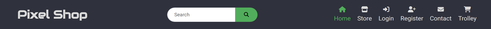

- Once logged in, these links are replaced with an Account link.

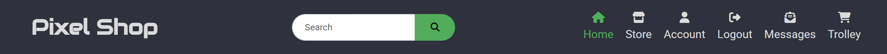

- On smaller screens, the navigation collapses into a hamburger menu.

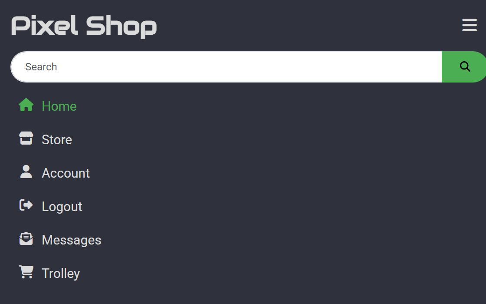

- When items are added to the trolley, the total value is displayed in the navbar.

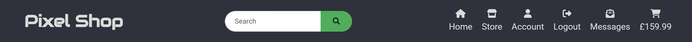

**Hero Section:** A welcoming section that introduces users to the Pixel Shop. It features a bold welcome message and two clear call-to-action buttons:

- Shop Now: Takes users directly to the store page.
- Login: Visible only to users who are not logged in, encouraging them to access their account or register.

**About Section:** Provides information about what Pixel Shop is, featuring an image of the physical store to add authenticity.

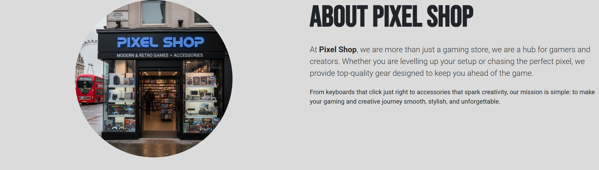

**Footer:** A clean footer displaying the shop’s social media links, address, and phone number for quick access to contact details.


**Register Page:** Allows new users to create an account quickly and easily.

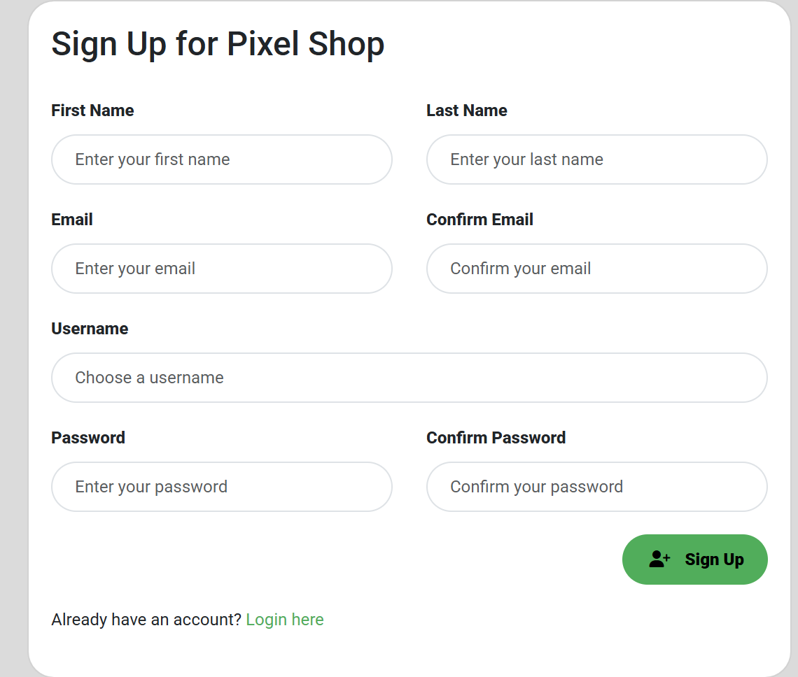

**Login Page:** Enables registered users to log in securely and access their account and order history.

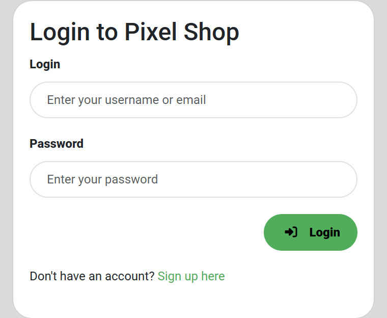

**Trolley Page:**

- If empty, it displays a friendly message and a button redirecting the user to the store.


- When items are added, users can update quantities, remove products, and view an order summary with a checkout button.

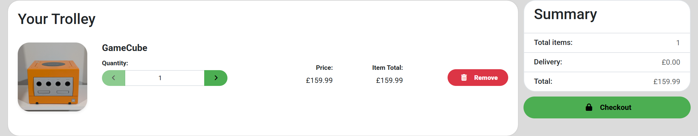

**Checkout Page:** Lets users review their order and enter their shipping details. Registered users can save this information for future purchases.

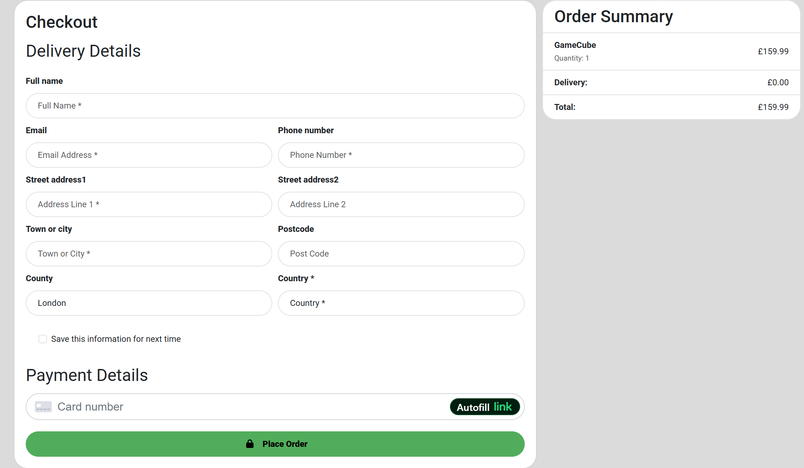

**Order Confirmation Page:** Displays a confirmation message and order summary after successful checkout.

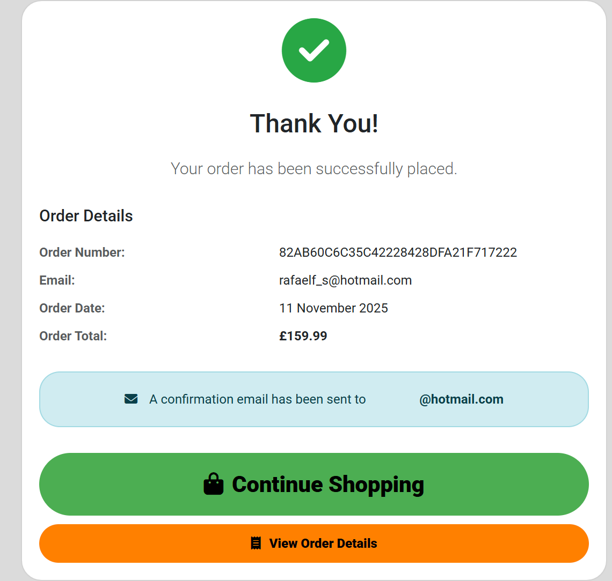

**Order Details Page:** Shows a detailed view of the user’s past orders for easy reference.

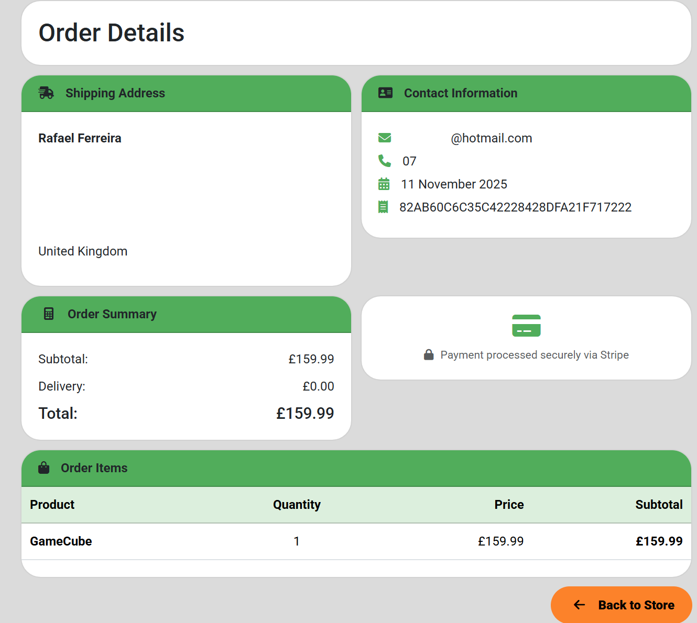

**Contact Page:**

- For regular users and visitors: displays a contact form with fields for name, email, and message.

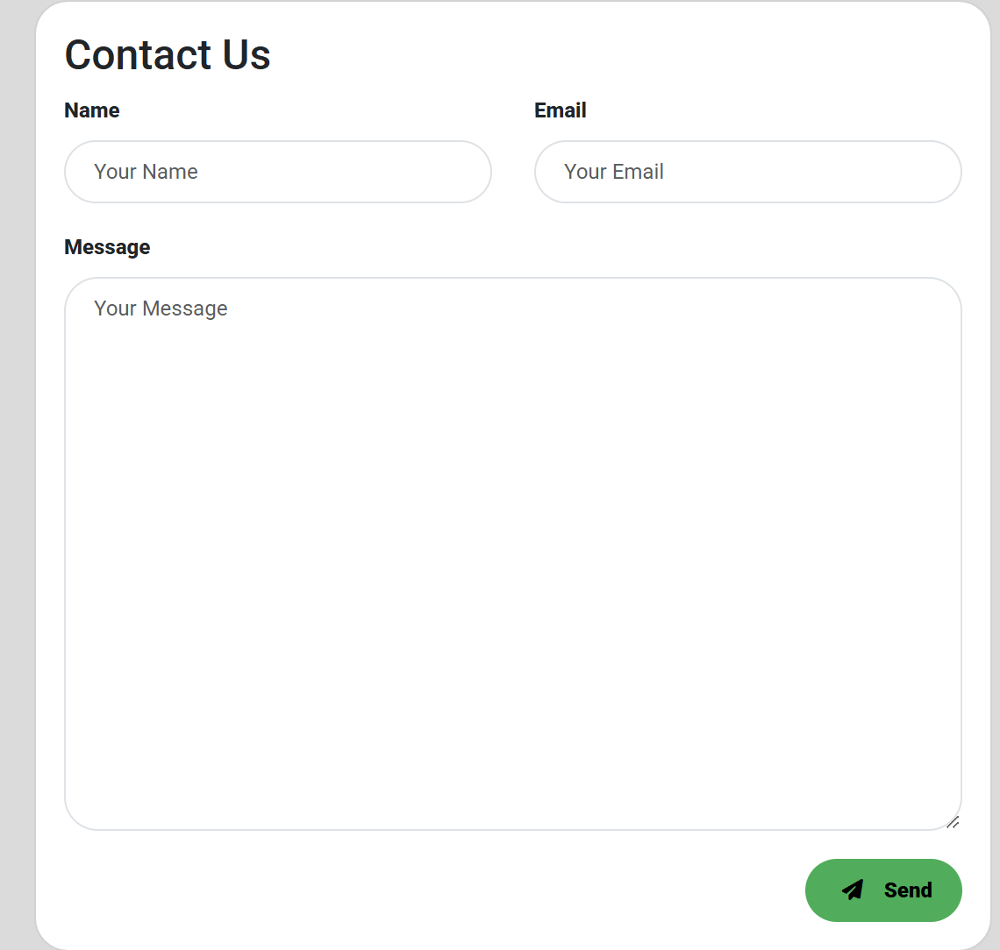

- For staff members: displays a list of all received messages, including sender details, message content, and a delete button.

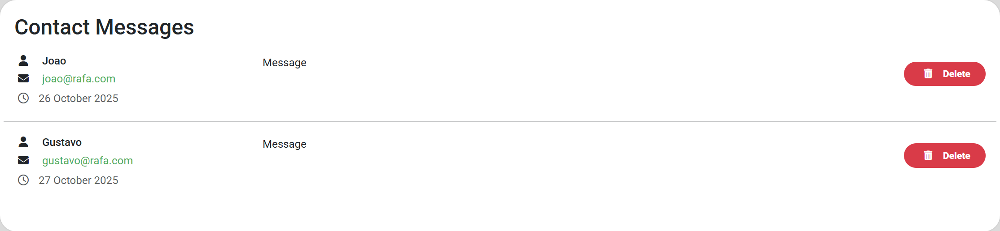

**Store Page:**

- Products are displayed in cards, 5 per page.

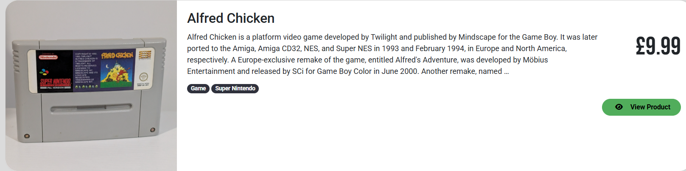

- Staff can see the edit and delete buttons in the card.

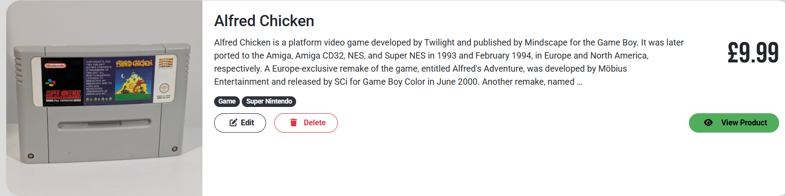

- Staff can see the button to add products at the top right.

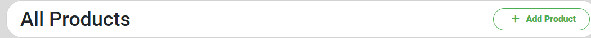

- Page to add new product.

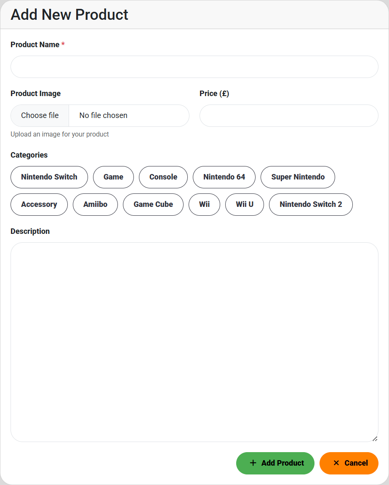

- Pagination navigation at the top and bottom of the page for easy access.

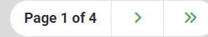

- Filters to locate products quicker.

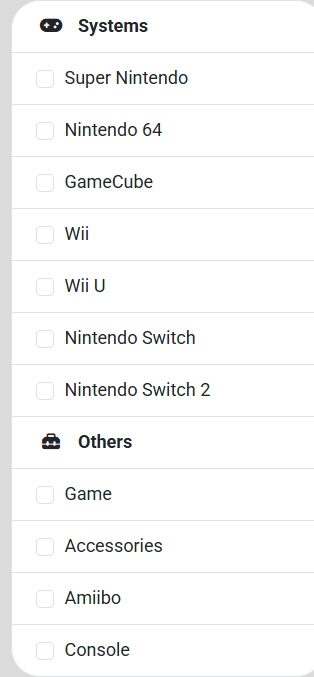

- Page with products detail, and add to trolley button with quantity.

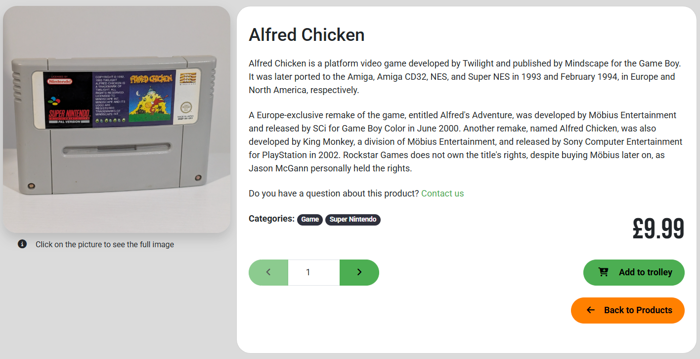

- Staff can see the edit and delete buttons in the product detail page.

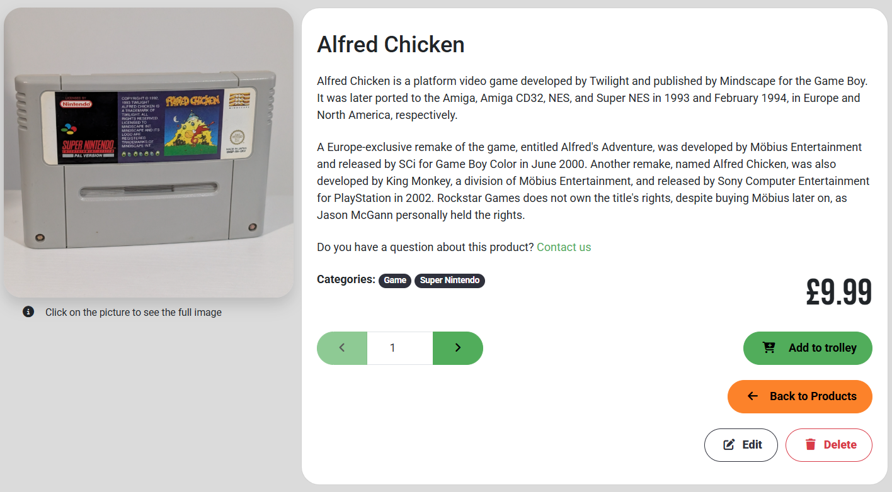

# 🔮 Future Features

- Front end user management for staff.
- Front end order management for staff.
- Stock control, if a product is out of stock, it should not appear on the list, and staff can add stock to any product.

# 🧪 Testing

## 🤖 Automated Testing

- Automated Testing was done in the home app.

```Bash
test_fields_are_required (home.tests.test_forms.ContactMessageFormTest.test_fields_are_required)
Test if fields are required ... ok
test_fields_have_correct_input_type (home.tests.test_forms.ContactMessageFormTest.test_fields_have_correct_input_type)
Test if fields have correct input type ... ok
test_form_has_correct_classes (home.tests.test_forms.ContactMessageFormTest.test_form_has_correct_classes)
Test that fields have correct classes ... ok
test_form_has_correct_fields (home.tests.test_forms.ContactMessageFormTest.test_form_has_correct_fields)
Test that form has the correct fields ... ok
test_form_has_placeholders (home.tests.test_forms.ContactMessageFormTest.test_form_has_placeholders)
Test that fields have placeholders ... ok
test_form_invalid_data (home.tests.test_forms.ContactMessageFormTest.test_form_invalid_data)
Test form with valid data ... ok
test_form_saves_correctly (home.tests.test_forms.ContactMessageFormTest.test_form_saves_correctly)
Test that form saves data to database correctly ... ok
test_form_uses_correct_model (home.tests.test_forms.ContactMessageFormTest.test_form_uses_correct_model)
Test that form uses ContactMessage model ... ok
test_form_valid_data (home.tests.test_forms.ContactMessageFormTest.test_form_valid_data)
Test form with valid data ... ok
test_form_has_form_control_class (home.tests.test_forms.CustomLoginFormTest.test_form_has_form_control_class)
Test that login field has form-control CSS class ... ok
test_form_inherits_from_login_form (home.tests.test_forms.CustomLoginFormTest.test_form_inherits_from_login_form)
Test that CustomLoginForm inherits from allauth LoginForm ... ok
test_login_form_has_correct_fields (home.tests.test_forms.CustomLoginFormTest.test_login_form_has_correct_fields)
Test that form has login and password fields ... ok
test_login_form_has_placeholder (home.tests.test_forms.CustomLoginFormTest.test_login_form_has_placeholder)
Test that login field has placeholder text ... ok
test_clean_matching_emails (home.tests.test_forms.CustomSignupFormTest.test_clean_matching_emails)
Test that matching emails pass validation ... ok
test_clean_non_matching_emails (home.tests.test_forms.CustomSignupFormTest.test_clean_non_matching_emails)
Test that non-matching emails raise validation error ... ok
test_fields_are_required (home.tests.test_forms.CustomSignupFormTest.test_fields_are_required)
Test if fields are required ... ok
test_fields_have_correct_classes (home.tests.test_forms.CustomSignupFormTest.test_fields_have_correct_classes)
Test if fields have correct classes ... ok
test_fields_have_correct_input_type (home.tests.test_forms.CustomSignupFormTest.test_fields_have_correct_input_type)
Test fields input type ... ok
test_fields_have_correct_labels (home.tests.test_forms.CustomSignupFormTest.test_fields_have_correct_labels) ... ok
test_form_has_correct_fields (home.tests.test_forms.CustomSignupFormTest.test_form_has_correct_fields)
Test that form has the correct fields ... ok
test_form_inherits_from_signup_form (home.tests.test_forms.CustomSignupFormTest.test_form_inherits_from_signup_form)
Test that CustomSignupForm inherits from allauth SignupForm ... ok
test_save_user_can_login (home.tests.test_forms.CustomSignupFormTest.test_save_user_can_login)
Test that saved user can authenticate ... ok
test_contact_message_created_at (home.tests.test_models.ContactMessageModelTest.test_contact_message_created_at)
Test the created_at field ... ok
test_contact_message_email (home.tests.test_models.ContactMessageModelTest.test_contact_message_email)
Test the email field ... ok
test_contact_message_message (home.tests.test_models.ContactMessageModelTest.test_contact_message_message)
Test the message field ... ok
test_contact_message_name (home.tests.test_models.ContactMessageModelTest.test_contact_message_name)
Test the name field ... ok
test_contact_message_ordering (home.tests.test_models.ContactMessageModelTest.test_contact_message_ordering)
Test that messages are ordered by created_at descending ... ok
test_contact_message_str_method (home.tests.test_models.ContactMessageModelTest.test_contact_message_str_method)
Test string representation of the model ... ok
test_contact_message_verbose_name (home.tests.test_models.ContactMessageModelTest.test_contact_message_verbose_name)
Test verbose name is set correctly ... ok
test_contact_message_verbose_name_plural (home.tests.test_models.ContactMessageModelTest.test_contact_message_verbose_name_plural)
Test verbose name plural is set correctly ... ok
test_contact_form_invalid_submission (home.tests.test_views.ContactPageViewTest.test_contact_form_invalid_submission)
Test submitting an invalid contact form ... ok
test_contact_form_valid_submission (home.tests.test_views.ContactPageViewTest.test_contact_form_valid_submission)
Test submitting a valid contact form ... ok
test_contact_page_contains_form (home.tests.test_views.ContactPageViewTest.test_contact_page_contains_form)
Test that contact page contains the form ... ok
test_contact_page_context_contains_user_messages (home.tests.test_views.ContactPageViewTest.test_contact_page_context_contains_user_messages)
Test that context includes user_messages ... ok
test_contact_page_displays_messages_oldest_first (home.tests.test_views.ContactPageViewTest.test_contact_page_displays_messages_oldest_first)
Test that messages are ordered by created_at ascending ... ok
test_contact_page_status_code (home.tests.test_views.ContactPageViewTest.test_contact_page_status_code)
Test that contact page returns 200 status code ... ok
test_contact_page_uses_correct_template (home.tests.test_views.ContactPageViewTest.test_contact_page_uses_correct_template)
Test that contact view uses the correct template ... ok
test_delete_message_as_staff (home.tests.test_views.DeleteMessageViewTest.test_delete_message_as_staff)
Test that staff can delete message ... ok
test_delete_message_requires_login (home.tests.test_views.DeleteMessageViewTest.test_delete_message_requires_login)
Test that delete view requires authentication ... ok
test_delete_message_requires_staff (home.tests.test_views.DeleteMessageViewTest.test_delete_message_requires_staff)
Test that delete view requires staff permissions ... ok
test_home_view_accessible_by_url (home.tests.test_views.HomeViewTest.test_home_view_accessible_by_url)
Test that home page is accessible by its URL ... ok
test_home_view_status_code (home.tests.test_views.HomeViewTest.test_home_view_status_code)
Test that home page returns 200 status code ... ok
test_home_view_uses_base_template (home.tests.test_views.HomeViewTest.test_home_view_uses_base_template)
Test that home template extends base.html ... ok
test_home_view_uses_correct_template (home.tests.test_views.HomeViewTest.test_home_view_uses_correct_template)
Test that home view uses the correct template ... ok
```

## 🧍‍♂️ Manual Testing

| Feature                   | Action                                                                       | Expected Result                                                                                                                                           | Tested | Passed | Comments                                                                                  |
| ------------------------- | ---------------------------------------------------------------------------- | --------------------------------------------------------------------------------------------------------------------------------------------------------- | ------ | ------ | ----------------------------------------------------------------------------------------- |
| Navigation Bar            | Open the webpage on various screen sizes (desktop, tablet, mobile).          | The navigation bar should be fully responsive and collapse into a burger menu on smaller screens.                                                         | Yes    | Yes    |                                                                                           |
| Navigation Bar            | Log in and observe the navigation bar links.                                 | The Account link should replace the Register and Login links after successful login.                                                                      | Yes    | Yes    |                                                                                           |
| Navigation Bar            | Click each navigation link.                                                  | Each link should load its corresponding page without errors.                                                                                              | Yes    | Yes    |                                                                                           |
| Navigation Bar            | Use the search bar to look for specific products.                            | User should be redirected to the Store page, displaying relevant search results.                                                                          | Yes    | Yes    |                                                                                           |
| Contact Page              | Fill in the contact form with name, email, and message, then click Send.     | The form should validate inputs, send the message successfully, and display a confirmation message.                                                       | Yes    | Yes    |                                                                                           |
| Contact Page (Staff View) | Log in as a staff member and open the contact page.                          | A list of all submitted messages should be displayed, showing sender name, email, message, and submission date. Each message should have a delete button. | Yes    | Yes    |                                                                                           |
| Register Page             | Register a new user with valid details.                                      | A confirmation email should be sent to the user, and after verification, login should be possible.                                                        | Yes    | Yes    |                                                                                           |
| Logout Page               | Click the Signout button.                                                    | The user should be logged out and redirected to the home page, with a confirmation message displayed.                                                     | Yes    | Yes    |                                                                                           |
| Login Page                | Log in using valid credentials.                                              | User should be successfully authenticated and redirected to the appropriate page.                                                                         | Yes    | Yes    |                                                                                           |
| Trolley                   | Open the trolley page with no items added.                                   | It should show a message saying there is no items in the trolley, and a button to the store.                                                              | Yes    | Yes    |                                                                                           |
| Trolley                   | Open the trolley page with items added.                                      | The page should allow updating quantities, removing items, viewing the order summary, and proceeding to checkout.                                         | Yes    | Yes    |                                                                                           |
| Store Page                | Visit the Store page                                                         | Product cards load, 5 per page.                                                                                                                           | Yes    | Yes    |                                                                                           |
| Store Page                | Click next/previous page                                                     | Page changes and shows correct set of products.                                                                                                           | Yes    | Yes    |                                                                                           |
| Store Page                | Apply category filters                                                       | Product list updates to match filters.                                                                                                                    | Yes    | Yes    |                                                                                           |
| Store Page                | Clear filters                                                                | Full product list reappears.                                                                                                                              | Yes    | Yes    |                                                                                           |
| Store Page                | Log in as staff                                                              | Edit/Delete buttons appear on each card.                                                                                                                  | Yes    | Yes    |                                                                                           |
| Store Page                | Staff clicks Edit                                                            | Redirects to Edit Product page.                                                                                                                           | Yes    | Yes    |                                                                                           |
| Store Page                | Staff clicks Delete                                                          | Confirmation prompt appears, product deletes.                                                                                                             | Yes    | Yes    |                                                                                           |
| Store Page                | Staff clicks Add Product                                                     | Redirects to Add Product page.                                                                                                                            | Yes    | Yes    |                                                                                           |
| Add Product Page          | Submit valid product data                                                    | Product is created and appears in store.                                                                                                                  | Yes    | Yes    |                                                                                           |
| Add Product Page          | Update existing product                                                      | Changes save and appear in store.                                                                                                                         | Yes    | Yes    |                                                                                           |
| Product Detail Page       | Open a product                                                               | Product details display correctly.                                                                                                                        | Yes    | Yes    |                                                                                           |
| Product Detail Page       | Choose quantity and click Add to Trolley                                     | Product is added to trolley with correct quantity.                                                                                                        | Yes    | No     | If the user has the product in the trolley, it won't add, it will replace, it should add. |
| Product Detail Page       | Log in as staff                                                              | Edit/Delete buttons appear on product detail page.                                                                                                        | Yes    | Yes    |                                                                                           |
| Product Detail Page       | Staff clicks Delete                                                          | Confirmation prompt; product deletes.                                                                                                                     | Yes    | Yes    |                                                                                           |
| Checkout Page             | Submit the form with empty fields.                                           | It should show a message to fill the field.                                                                                                               | Yes    | Yes    |                                                                                           |
| Checkout Page             | Submit a valid form.                                                         | It should redirect to the confirmation page, and send an email to the user.                                                                               | Yes    | Yes    |                                                                                           |
| Checkout Page             | Set address in the Profile Page, and check if it shows on the checkout page. | It should get the information saved by the user, and display in the checkout page.                                                                        | Yes    | Yes    |                                                                                           |
| Checkout Page             | Check the save this information.                                             | It should update the default address in the profile page.                                                                                                 | Yes    | Yes    |                                                                                           |
| Confirmation Page         | Click on order details button.                                               | It should redirect to the order details page.                                                                                                             | Yes    | Yes    |                                                                                           |
| Account Page              | Visit the Account Page                                                       | It should show a form to update delivery address, and order history.                                                                                      | Yes    | Yes    |                                                                                           |

# 🐞 Bugs

- When opening the filters menu in Chrome for MacOS, it is crashing Chrome

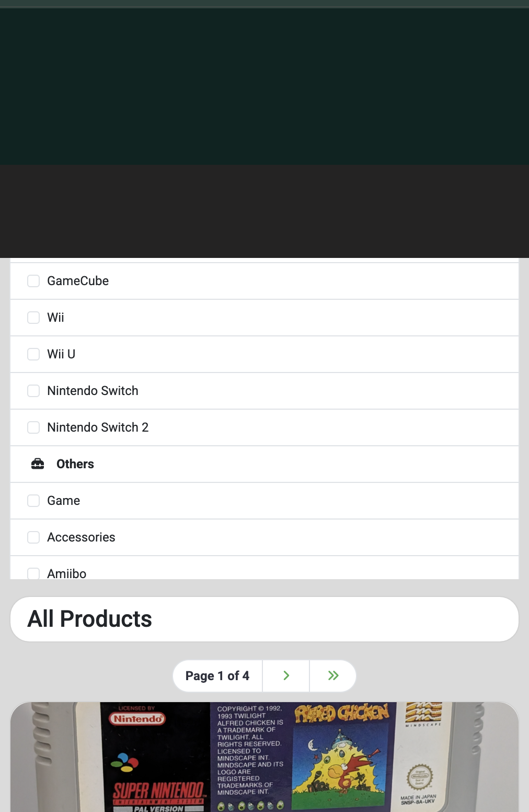

# 📜 Credits

## 💡 Code

- [AWS S3 Tutorial](https://www.youtube.com/watch?v=JQVQcNN0cXE&t=404s)
- [HTMX Tutorial](https://www.youtube.com/watch?v=O0_ZyUsG7wo) - For the pagination and search functionality.
- [SCSS Tutorial](https://www.youtube.com/watch?v=_kqN4hl9bGc&list=PL4cUxeGkcC9jxJX7vojNVK-o8ubDZEcNb) - To edit Bootstrap.

## 🖼️ Images

- [Hero Image](https://www.pexels.com/photo/a-close-up-shot-of-a-nintendo-switch-6993182/)
- Store picture on about section was generated by Gemini.
- The products images were taken by me.
